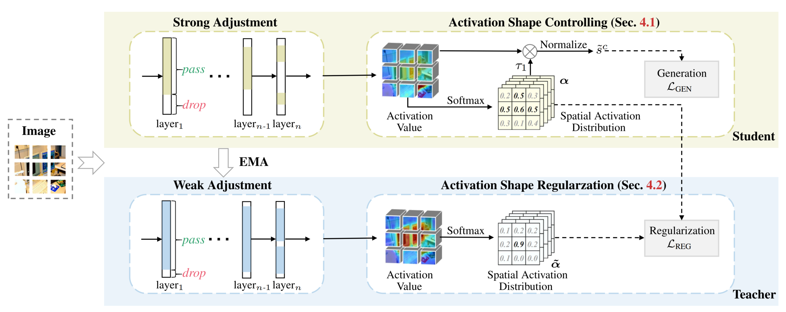

# USAGE
The pytorch code for our ICCV paper [USAGE: A Unified Seed Area Generation Paradigm for Weakly Supervised Semantic Segmentation](https://arxiv.org/abs/2303.07806).

<p align="center">
  
</p>
<p align = "center">
Fig.1 - Overview of USAGE
</p>


## Prerequisite
- Ubuntu 18.04, with Python 3.9 and the following python dependencies.
```
pip install -r prerequisite.txt
```
- Download [the PASCAL VOC 2012 development kit](http://host.robots.ox.ac.uk/pascal/VOC/voc2012).

## Usage
Run the run.sh script for training USAGE, visualizing and evaluating the generated seed areas. 
```
bash run.sh
```
### PASCAL VOC 2012 dataset

| Model        | Backbone   | Google drive |
|--------------|------------|--------------|
| USAGE | DeiT-small  | [Weights] |
| USAGE | ResNet38    | [Weights] |

[PSA](https://github.com/jiwoon-ahn/psa) was used to post-process the USAGE-based seed areas to generate pseudo masks.

## Acknowledgement
Thanks to excellent works and their codebases of [MCTformer](https://github.com/xulianuwa/MCTformer) and [SEAM](https://github.com/YudeWang/SEAM). 

## Citation
Please consider citing our paper if the code is helpful in your research and development.
```
@inproceedings{peng2023USAGE,
  title={USAGE: A Unified Seed Area Generation Paradigm for Weakly Supervised Semantic Segmentation},
  author={Peng, Zelin and Wang, Guanchun and Xie, Lingxi and Jiang, Dongsheng and Shen, Wei and Tian, Qi},
  booktitle={Proceedings of the IEEE/CVF International Conference on Computer Vision},
  year={2023}
}
```
